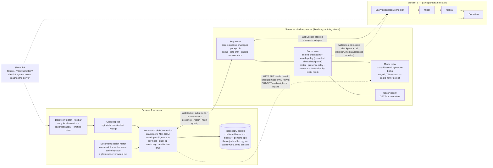

# wordinweb collab demo — anon-share

The public showcase from the plan (`internal/collab-plan/11-threat-model.md`),
two modes:

- **Magic link** — click *New document* → get an unguessable URL → share it
  (Hacker-News-post style) → a small group edits with the full feature set.
  The URL is the capability (an unguessable ≥128-bit id).
- **Party doc** — join a rotating shared document with a crowd of strangers,
  text + presence only. Deliberately minimal surface, so this
  highest-exposure anonymous mode is **structurally XSS-free** (no
  authored-URL, media, or import sink is enabled).

## Zero-custody encrypted deployment

This example runs `wordinweb/collab` in encrypted-only mode. The server is a
**blind sequencer**: it orders opaque encrypted envelopes and relays bytes,
but never holds a document key or parses a document. It keeps room state in
memory only. Each browser holds a durable copy, and the document key rides in
the share link's `#fragment`, which browsers do not send to the server.

The server must enforce this mode. Set `WW_ENCRYPTED_ONLY=1`, or pass
`encryptedOnly: true` to `handleSeedRequest`. A client-only restriction is not
a security boundary because encrypted and plaintext rooms use the same
`/docs` route.

### Architecture



The server can see padded envelope size classes, timing, participant counts,
and the SHA addresses of media ciphertext. It cannot see document content,
media pixels, part structure, or the key. Each client derives the same
canonical history by applying the same ordered log. An engine-version fence
refuses mixed client builds rather than allowing them to diverge.

### Deploy

A host with Docker, a DNS A record, and ports 80/443 open can run:

```sh
git clone <repo> && cd wordinweb/examples/anon-share
DOMAIN=docs.example.com docker compose up -d
```

Caddy provisions a Let's Encrypt certificate, serves the built app at `/`,
and proxies the collaboration routes on the same origin. Without `DOMAIN`, it
uses `localhost` with Caddy's internal CA.

**TLS is required.** The encrypted flows use WebCrypto, and `crypto.subtle`
requires a [secure context][sc].

[sc]: https://developer.mozilla.org/en-US/docs/Web/Security/Secure_Contexts

`compose.cloudflare.yml` runs the same services behind a
[Cloudflare Tunnel][cft]. The host publishes no ports, and TLS terminates at
Cloudflare's edge:

```sh
TUNNEL_TOKEN=… docker compose -f compose.cloudflare.yml up -d
```

Point the tunnel hostname at `caddy:80`. Caddy replaces
`X-Forwarded-For` with Cloudflare's `CF-Connecting-IP`, so
`WW_TRUST_PROXY=1` remains correct.

[cft]: https://developers.cloudflare.com/cloudflare-one/connections/connect-networks/

### Operations

| | |
|---|---|
| **Restarts** | A restart clears every live room. Browsers hold the durable documents and revive them on reconnect. The stack has no document database or document volume. |
| **Scale** | One process uses one core. Rooms are in memory. `WW_ROOM_CAP` caps participants per room. |
| **Session lifecycle** | Empty rooms expire after `WW_EMPTY_ROOM_TTL_MS`. Inactive rooms receive a warning, then end at `WW_IDLE_TIMEOUT_MS`. Every room ends at `WW_ROOM_MAX_LIFETIME_MS`. |
| **Surge valves** | `WW_WS_MAX_PAYLOAD`, `WW_WS_MAX_BUFFERED`, `WW_ROOM_LOG_MAX_BYTES`, `WW_MAX_ROOMS_GLOBAL`, and `WW_MAX_CONNS_GLOBAL` bound server work and memory. |
| **Media** | The relay holds encrypted blobs within per-blob, per-room, RAM, and disk limits. Evicted blobs can be supplied again by a participant. |
| **Per-IP limits** | `WW_IP_SEED_PER_MIN`, `WW_IP_MAX_DOCS`, and `WW_IP_MAX_CONNS` bound what one address can create. `WW_TRUST_PROXY` is a hop count. |
| **Health** | `GET /healthz` reports liveness. Compose enables the internal `GET /stats` route for the private operations dashboard. |
| **Document size** | `WW_MAX_DOC_BYTES` limits the decoded document size. Encrypted rooms retain a sealed checkpoint in memory. |
| **Mode** | `WW_ENCRYPTED_ONLY=1` rejects plaintext seeds. |
| **Logs** | The server writes structured logs to stderr. Compose bounds the JSON log files. |
| **Media routes** | The routes are unauthenticated. They require an open room and apply size and rate limits before accepting an upload body. |

## What's implemented and tested

The server-side demo logic lives in `@wordinweb/server` (`src/demo.ts`) and is
unit-tested (`test/demo.test.ts`):

- `makeDocId(randomBytes)` — unguessable 128-bit doc ids (the magic-link
  capability).
- `PartyPool` — round-robin assignment of visitors onto a fixed set of shared
  docs (bounded storage/abuse surface).
- `DEMO_INTENT_ALLOWLIST` / `intentAllowedInDemo(mode, kind)` — the explicit
  enabled-intent allowlist per mode (party = text-only; magic-link = the full
  implemented set; **no authored-URL intents** in either until the
  scheme-allowlist gate).
- `RateLimiter` — token-bucket abuse limits (per-IP doc creation,
  per-connection intents).

The collab loop these drive (`@wordinweb/collab` + `@wordinweb/server`) is
tested end to end headlessly (multi-client convergence, presence,
persistence). The client binding (`bindEditor`, `useCollab`) is tested via the
in-process loopback.

## Run locally

From the repository root:

```sh
npm install
npm run demo
```

This command builds all packages, starts the encrypted-only collaboration
server on port `1234`, starts Vite on port `5817`, and opens the browser.
Press Ctrl+C to stop both processes.

Click **New document**. The page adopts an unguessable `?doc=<id>` URL. Copy
that URL into a second browser tab to test edits and cursors.

For separate terminals, run `npm run build` from the root. Then run
`npm run server` and `npm run dev` from this directory. Open
`http://localhost:5817/?server=localhost:1234` so Vite uses the server port.

`src/app.tsx` shows the wiring: `<CollabEditor url docId clientId editable />`
composes `useCollab({ url, docId, clientId })` → the live `DocxView`. The
harness (`main.tsx` + `index.html` + `vite.config.ts`) is dev-only and not
shipped to npm. The headless test suite covers the protocol, convergence, and
binding logic; the DOM rendering runs here in the browser.

## Security posture (doc 11)

Uploads and document import are disabled (docs start blank). Rich paste is
disabled (plain text only). Demo runs on an isolated signing key and isolated
capacity, behind the rate limits above, with a strict CSP. Hyperlink
authoring is off until the scheme-allowlist launch gate (already implemented
in core `url-safety.ts`, but the authoring intent is not yet enabled).
